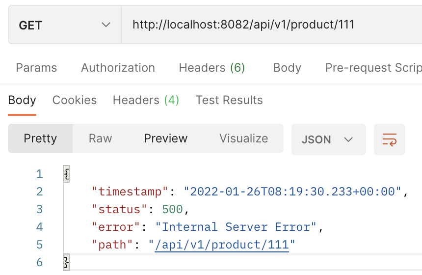
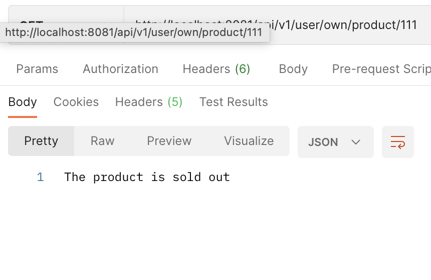
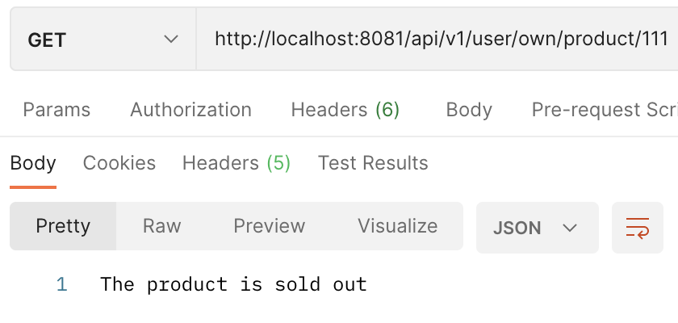
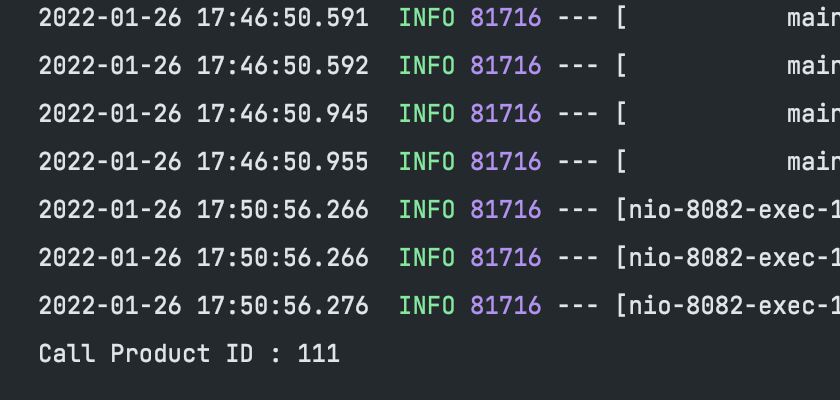
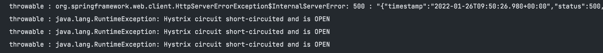
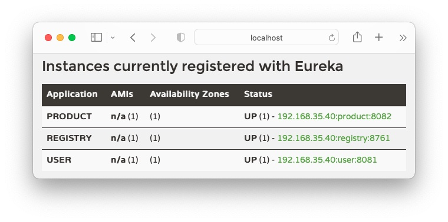
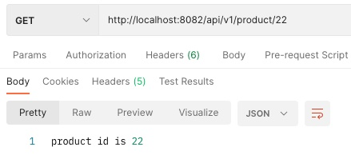
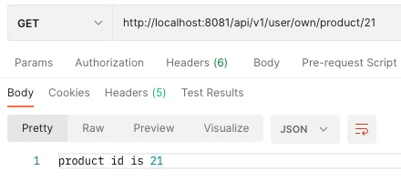

# TIL; Spring Cloud

* SK planet T아카데미 토크ON세미나 에서 진행한 <code>Spring Cloud를 활용한 MSA 기초</code> 를 바탕으로 학습. <br/>
** 강의에 사용된 Github : <https://github.com/Gunju-Ko/spring-cloud-workshop>

## Index
1. [Hystrix](#Circuit-breaker---Hystrix) - <sup>2022-01-26</sup>
2. [Ribbon](#Client-Load-Balancer---Ribbon) - <sup>2022-01-27</sup>
3. [Eureka](#Service-Registry---Eureka) - <sup>2022-01-29</sup>
4. [Feign](#Declarative-Http-Client---Feign) - <sup>2022-01-17</sup>

<br/>

---
<p align="right"> <sup>2022-01-26</sup><br/> </p>

## Circuit breaker - Hystrix
Circuit breaker; 전류를 차단하는 장치이다. ```Hystrix```는 Micro Service의 Circuit Breaker 역할. <br/>
문제가 있는 Micro Service 로의 트래픽을 차단; 전체 서비스의 문제를 미리 방지

### 문제점 

분산 시스템 / 클라우드 환경에선 실패는 일반표준이다 (Failure as a First Class Citizen); <br/>
- Monolithic 환경에서는 의존성 호출을 Method를 통해 진행; 따라서 100% 신뢰
- 반면 Micro Service 환경에서 한 서비스의 가동률(uptime)이 최대 99.99% 라고 가정 시 1억개의 요청이 들어 오면 1만개의 요청이 실패하하는 셈;
  (30개의 서비스로 구성 시 -> 99.99^30 = 99.7% uptime 이므로 0.3% 인 30만개가 된다.)

<sup>** ref : https://velog.io/@chlee4858/인강-Spring-Cloud를-활용한-MSA-기초-4강-Circuit-Breaker-Hystrix </sup>

Latency Tolerance and Fault Tolerance for Distributed Systems <br/>
<sub>분산 시스템에서 지연감내 및 실패감내</sub> 

기본 설정의 임베디드 톰캣 4개로 구성된 경우
```
timeout     : infinity
maxThreads  : 200
                    ┏━━━━━━━━┓
               ┏━━━▶┃ Tomcat ┣━━━━┓
┏━━━━━━━━┓     ┃    ┗━━━━━━━━┛    ┃     ┏━━━━━━━━┓
┃ Tomcat ┣━━━━━┫                  ┣━━━━▶┃ Tomcat ┃
┗━━━━━━━━┛     ┃    ┏━━━━━━━━┓    ┃     ┗━━━━━━━━┛
               ┗━━━▶┃ Tomcat ┣━━━━┛         ▲ 마지막 톰캣이 다운 시 
                    ┗━━━━━━━━┛
```
마지막 서비스가 다운 시, Tomcat의 최대 Thread 인 200개가 꽉찰때까지 무한대기 / 200개가 꽉찬 후 Down

### 해결법
1. Container의 Thread를 직접 사용하지 못하게 함.
2. Queue로 대기열 사용 X -> 빠르게 Failure
3. 실패로부터 서비스 보호를 위해 Fallback 제공
<br/>...

<sup>** ref : https://sabarada.tistory.com/52 </sup>

<b> < Circuit Breaker Pattern > </b>

```
┏━━━━━━━━━━━┓   ┏━━━━━━━━━━━━━━━━┓   ┏━━━━━━━━━━━┓
┃ Service A ┃   ┃ CircuitBreaker ┃   ┃ Service B ┃
┃           ┃   ┃                ┃   ┃           ┃
┃  ( CALL )━╋━━━╋━━━━(Bypass)━━━━╋━━▶┃ ( GOOD )  ┃ 정상 시
┃           ┃◀━━╋━━━━━━━━━━━━━━━━╋━━━╋━━━━┛      ┃
┃           ┃   ┃                ┃   ┃           ┃
┃  ( CALL )━╋━━━╋━━━(Fallback)   ┃   ┃ ( DOWN )  ┃ 서버 다운/지연 시
┃           ┃◀━━╋━━━━━━━┛        ┃   ┃           ┃
┗━━━━━━━━━━━┛   ┗━━━━━━━━━━━━━━━━┛   ┗━━━━━━━━━━━┛
```

두 서비스 A, B 가 존재 시, A가 B로의 모든 호출은 Circuit Breaker 를 통과한다.

- B가 정상일 경우 : Traffic 을 문제업이 Bypass;
- B에 문제를 감지 : Circuit Breaker 를 강제적으로 차단; 장애가 전파됨을 막음 / Fallback Messaging 을 통해 임시 메시지를 리턴 할 수 있도록한다. 예를 들어 A가 상품조회, B가 상품추천 일 때 B에 장애가 나면 운영자가 미리 설정해둔 추천 상품을 제공하는 등 시스템의 장애를 최소화 할 수 있다.

** Hystrix는 일정횟수 이상 비정상적인 응답이 발생하면 Close 상태에서 Open 상태로 Trip(이동); - Circuit Open : 차단 상태 <br/>
** Back Pressure 란? : 수돗물이 흐를때, 물을 받아낼 것이 없다면 수돗꼭지를 잠그는 것; / MSA 에선 이런 수도꼭지를 잠그고 ```전체적인 시스탬장에로 전파되는것을 막는 것``` <br/>
** Fail Fast : 조기 차단 <br/>

<sup>** ref : https://bcho.tistory.com/1247 </sup>

Hystrix의 순서도는 아래와 같다
<p align="center">  </p>

### Dependency

< Gradle >
``` gradle

// https://spring.io/projects/spring-cloud
// 위 링크에서 Spring Boot Version 과 맞는 버전 확인 후 작성

ext {
    set('springCloudVersion', "2021.0.0")
}

dependencyManagement {
  imports {
    mavenBom "org.springframework.cloud:spring-cloud-dependencies:${springCloudVersion}"
  }
}

// ----- 이까진 다른 항목 공통사항

dependencies {
    implementation 'org.springframework.cloud:spring-cloud-starter-netflix-hystrix'
}
```

### 한번 적용해보기

```
┏━ User ━━━━━━━━━━━━┓ [1]                             ┏━ Product ━━━━━━━━━┓
┃            ┏━━━━━━╋━( api/../product/{id} call )━X━▶┃                   ┃
┃ someFunc(Long id) ┃    ┏━━━━━━━━━━━━━━━━━┓          ┃    product api    ┃
┃                   ┃◀━━━┃ Circuit Breaker ┃          ┃                   ┃
┗━━━━━━━━━━━━━━━━━━━┛ [2]┗━━━━━━━━━━━━━━━━━┛          ┗━━━━━━━━━━━━━━━━━━━┛
```

다음과 같이 User 서비스에서 Product 서비스를 호출 시 문제가 발생하면 Circuit Breaker 가 Fallback 을 반환하도록 만들어보자<br/>

<br/>
<b>< User Service ></b>
<p align="right"> ( User ) Controller </p> 

``` java
@SpringBootApplication
@EnableCircuitBreaker       // 추가
public class UserApplication {

    @Bean
    public RestTemplate restTemplate() {
        return new RestTemplate();
    }
    
    public static void main(...) {
        SpringApplication.run(...);
    }
}
```
Root Package에 '@EnableCircuitBreaker' Annotation을 추가하여 Circuit Breaker 사용여부를 선언 <br/>
서비스에서 RestTemplate을 사용할 것이니 RestTemplate 빈을 생성한다.

<p align="right"> ( User ) Controller </p>

``` java
@RestController
@RequiredArgsConstructor
@RequestMapping(value = "/api/v1/user", produces = MediaType.APPLICATION_JSON_VALUE)
public class UserController {

	private final ProductRemoteService productRemoteService;

	@GetMapping("/own/product/{id}")
	public String getProductInfo(@PathVariable("id") Long id) {
		return productRemoteService.getProductInfo(id);
	}
}
```

<p align="right"> ( User ) Product Remote Service </p>

``` java
@RequiredArgsConstructor
@Service
public class ProductRemoteService {

	private static final String url = "http://localhost:8082/api/v1/product/";

	private final RestTemplate restTemplate;

	@HystrixCommand(fallbackMethod = "getProductInfoFallback")
	public String getProductInfo(Long productId) {
		return this.restTemplate.getForObject(url+productId, String.class);
	}

	public String getProductInfoFallback(Long productId) {
		return "The product is sold out";
	}
}
```
@HystrixCommand 어노테이션을 추가할 경우 getProductInfo 메소드 호출을 Interept 하여 대신 실행; 이때 성공/실패 여부를 판단 후 그에 해당하는 조치를 취함.<br/>
이때 fallbackMethod Option을 통해 Fallback 메소드를 지정해 줄 수 있으며 문제 발생시 Fallback 메소드를 실행하여 차선의 결과를 제공할 수 있다. <br/>

<br/>
<b>< Product Service ></b>
<p align="right"> ( Product ) Controller </p> 

``` java
@RestController
@RequestMapping(value = "/api/v1/product", produces = MediaType.APPLICATION_JSON_VALUE)
public class ProductController {

	@GetMapping("/{id}")
	public String getProductInfo(@PathVariable("id") Long id) {
		throw new RuntimeException("I/O Exception");
	}
}
```
일부로 Runtime Exception 을 발생시켜 실습을 진행하였다.

### Result

<table>
  <tr>
    <th width="50%" align="center"> <code>Product API</code> 를 호출했을 경우 </th>
    <th width="50%" align="center"> Product API 를 호출하는 <code>User API</code> 를 호출했을 경우 </th>
  </tr>
  <tr>
    <td align="center">  </td>
    <td align="center">  </td>
  </tr>
</table>
<br/>

### Fallback 원인을 알아보자

<p align="right">  ( User ) Product Remote Service </p>

``` java
...

    public String getProductInfoFallback(Long productId, Throwable t) {
        System.out.println("[Log] Product Remote Service In User | getProductInfo Fallback Run : " + t);
		return "The product is sold out";
	}
	
...
```
다음과 같이 Fallback 함수에 Throwable 타입의 인자를 사용하면 요청의 에러를 조회 할 수 있다.

### Hystrix의 Timeout 설정하기

@HystrixCommand 어노테이션이 붙은 메소드는 Timeout 시간 내 처리가 되지 않으면 Exception 이 발생한다. 기본 설정 시간은 1000ms (1s)

<p align="right">  ( User ) Product Remote Service </p>

``` java
    @GetMapping("/{id}")
	public String getProductInfo(@PathVariable("id") Long id) {
		try {
			Thread.sleep(2000);
		} catch (Exception e) {
			e.printStackTrace();
		}
		
		System.out.println("Call Product ID : " + id);
		return "product id is " + String.valueOf(id);
	}
```
Product 서비스의 Controller 를 다음과 같이 수정 후 User 서비스를 호출하면 Fallback 이 호출되는것을 확인할 수 있다. <br/>
( Hystrix 의 기본 Timeout 값은 1000ms / Product 서비스는 2000ms 후 값을 리턴한다. ) <br/>

<table>
  <tr>
    <th width="50%" align="center"> User API 를 호출했을 시 Client 가 받는 값 </th>
    <th width="50%" align="center"> Product API 의 로그 </th>
  </tr>
  <tr>
    <td align="center">  </td>
    <td align="center">  </td>
  </tr>
</table>
하지만 위 결과를 보면 1초 후 Fallback이 반환되었음에도 2초 후 Product 서비스에서 System.out.println 가 작동되었다. <br/>
Log 출력이 가능했던 이유는 Product (불리는 입장) 의 Timeout이 아닌 User (부르는 입장) 의 Timeout 이기때문에 Product (불리는 입장) 에서는 전혀 영향이 없기때문에 정상작동하였다. <br/> 
User (부르는 입장) 에서는 Hystrix 가 Interupt 를 걸었기 때문에 Fallback이 작동. <br/>
<br/>

<b>application.yml 또는 application.properties 에서 Timeout 시간 변경</b>
``` yaml
hystrix:
  command:
  
    # 전역설정
    default:
      execution.isolation.thread.timeoutInMilliseconds: 3000
      
    # 특정 commandKey에 대한 설정
    getInfo:
      execution.isolation.thread.timeoutInMilliseconds: 10000
```
다음 속성에 값을 설정하면 Timeout시간이 변경된다. 위 실습의 Product 서비스가 구동되기 위해서 3000 값을 넣으면 User 서비스가 정상적으로 값을 받아오는것을 확인 할 수 있다.

``` java
@HystrixCommand(commandKey = "getInfo", fallbackMethod = "getProductInfoFallback")
```
다음과 같이 @HystrixCommand 적용 시 commandKey 속성을 정의한다면 따로 설정을 달리할 수 있다.<br/>

### Circuit Open 테스트

``` yaml
hystrix:
  command:
    default:
      circuitBreaker:
      
        # n회 이상 시 Circuit Open ( default : 20 ) 
        requestVolumeThreshold: 1
        
        # 정해진 시간 내 n% 의 요청이 Error일 시 Circuit Open ( default : 50 )
        errorThresholdPercentage: 50
        
        # 한번 Open 된 Circuit 을 n 동안 유지 ( default: 5000 )
        SleepWindowInMilliseconds: 5000
        
        # 발생하는 Error를 n 동안 카운팅 ( default : 10000 )
      metrics:
        rollingStats.timeInMilliseconds: 10000
        
        # default 값을 유지 시 
        #   10s 동안 20회 이상 호출될 경우 50% 이상 실패하면 Circuit Open
        
        # 바뀐 설정값 적용 시
        #   10s 동안 1회 이상 호출될 경우 50% 이상 실패하면 Circuit Open   
```
다음 중 <code>requestVolumeThreshold</code>, <code>errorThresholdPercentage</code> 만 위와 같이 바꾸어 Fallback 이 실행 될 수 있는 환경으로 실습해보았다. <br/>

<table>
  <tr>
    <th width="50%" align="center"> Circuit Open 조건 변경 시 </th>
  </tr>
  <tr>
    <td align="center">  </td>
  </tr>
</table>

다음과 같이 Product 호출에 실패가 발견될 경우 <code>Hystrix circuit short-circuited and is OPEN</code> 라는 Runtime Exception 이 발생; Circuit 이 Open 됨을 확인할 수 있다. <br/>
이는 <code>SleepWindowInMilliseconds</code> 의 기본값임 5000ms 동안 유지된 후 Circuit Close 상태로 돌아오게된다. <br/>
<br/>


---
<p align="right"> <sup>2022-01-27</sup><br/> </p>

## Client Load Balancer - Ribbon

Ribbon 은 Client-Side Load Balancer 이며 Server-Side Load Balancer 를 사용했을때 단점들을 보안;

### Server-Side Load Balancer
기존 Server-Side Load Balancer 는 L4 Switch 를 사용하여 Load Balancing 을 진행; <br/> 
Client 는 L4 주소만 알고있으며 / L4 스위치가 서버 목록을 알고있음 

<p align="right"> Server-Side Load Balancer </p> 

```
                                  ┏━━━━━(Server 1)  
                                  ┃                 
┏━━━━━━━━┓          ┏━━━━━━━━┓    ┣━━━━━(Server 2)  
┃ Client ┣━━━━━━━━━▶┃   LB   ┣━━━━┫                 
┗━━━━━━━━┛          ┗━━━━━━━━┛    ┣━━━━━(Server 3)  
                                  ┃                 
                                  ┗━━━━━(Server 4)  
```

<b>< Server-Side Load Balancer 의 단점 ></b>
1. 비싼 비용 / 떨어지는 유연성
2. 서버 추가를 위해 설정이 필요함 -> 자동화가 어려움
3. Load Balancing Schema 가 한정적 (Round Robbin, Sticky, ...) <br/>
...

### Client-Side Load Balancer
Server가 아닌 Client가 Load Balancing 을 진행 <br/>
Client (API Caller) 에 탑재되는 S/W 모듈; 주어진 서버 목록에서 Load Balancing 이 이루어짐 <br/>
위 Server-Side 에서 발생하는 3가지 단점이 모두 보안된다.

```
                                     ┏━━━━━(Server 1)  
┏━━━━━━━━━━━━━━━┓                    ┃                 
┃  Client  ┏━━━━┻━━━┓                ┣━━━━━(Server 2)  
┃ (Caller) ┃ Ribbon ┣━━━━━━━━━━━━━━━▶┃                 
┃          ┗━━━━┳━━━┛                ┣━━━━━(Server 3)  
┗━━━━━━━━━━━━━━━┛                    ┃                 
                                     ┗━━━━━(Server 4)  
```

### Ribbon 구성요소

1. Server List :
  Load Balancing 대상 서버 목록
  Configuration -> Static 하게 설정 / Eureka -> Dynamic 하게 설정
2. Rule :
  Load Balancing Schema;
  Round Robbin, Available Filtering, weighted Response Time ..
3. Ping :
  서버 목록이 모두 살아있는지 체크;
4. Retry :
  Server 로부터 응답을 받지 못했을 경우 동일한 서버 또는 다른 서버로 재시도;

### Dependency
``` gradle
dependencies {
    implementation 'org.springframework.cloud:spring-cloud-starter-netflix-ribbon'
}
```

<sup>** ref : https://sabarada.tistory.com/54 </sup>

### 한번 적용해보기

<p align="right"> ( User ) Application </p>

``` java
@SpringBootApplication
public class UserApplication {

    @Bean
    @LoadBalanced   // 추가
    public RestTemplate restTemplate() {
        return new RestTemplate();
    }
    
    ...
}
```
RestTemplate Bean에 <code>@LoadBalanced</code> 어노테이션을 추가

<p align="right"> ( User ) Product Remote Service </p>

``` java
// 수정 전
private static final String url = "http://localhost:8082/api/v1/product/";

// 수정 후 
private static final String url = "http://product/api/v1/product/";
```
위 구문을 아래와 같이 변경 ( service 주소 -> service 이름 )
RestTemplate 에 들어갈 URL 을 다음과 같이 변경해준다. 이후 <code>application.yml</code> 또는 <code>application.properties</code> 에 Ribbon 설정을 넣어준다. 

<p align="right"> ( User ) application.yml 속성 </p>

``` yaml
product:
  ribbon:
    listOfServers: localhost:8082
```

서비스의 리본 속성을 설정해준다.

<table>
  <tr>
    <th width="50%" align="center"> Ribbon 적용 후 요청 결과 </th>
  </tr>
  <tr>
    <td align="center">  </td>
  </tr>
</table><br/>

## How It Works
```
 RestTemplate Beans 에 <code>@LoadBalanced</code> 를 적용 <br/>
   ↘ RestTemplate 에 Interceptor 를 추가  
      ↘ Interceptor 내부에서 RestTemplate 으로 들어온 URL을 Configuration 에 등록된 값으로 변경 
```
<br/>

### Retry 기능을 추가해보기

Retry 란 말 그대로 서버에 요청 시 실패했을 경우, 다시 서버에 요청을 보내는 것을 Retry 라고 한다.

``` yaml
product:
  ribbon:
    listOfServers: localhost:8082, localhost:7777
    
    // 동일 서비스 연결시도 횟수
    MaxAutoRetries: 0
    
    // 다음 서비스 연결 시도 횟수
    MaxAutoRetriesNextServer: 1
    
    // retry 가 가능한 StatusCode 도 설정할 수 있다.
    retryableStatusCodes: 503, 408
    
```

Retry 는 목록에 등록된 서버를 Round Robbin 방식으로 진행; <br/>
위 설정으로 수정 후 Retry 를 적용할 경우, <code>7777 port</code> 의 서버는 만든적이 없으므로 접속하게되면 Exception이 발생하고 <code>MaxAutoRetriesNextServer</code> 설정이 <code>1</code> 이므로 다음 서버로 요청을 다시 보내게 된다.

<b>Dependency</b>
``` gradle
dependencies {
    implementation 'org.springframework.retry:spring-retry'
}
```
<br/>

<b> Error </b>

> Rerty Dependency 추가 시 RetryLoadBalancerInterceptor 가 추가되지 않음 <br/>
> -> Hoxton 이후 Netflix Ribbon 이 Spring Cloud 에서 재공되지않음 <br/>
> -> -> 대체된 다른 패키지와 충돌 ? 차후 알아보고 추가 및 수정 

<br/>
<br/>


-----
<p align="right"> <sup>2022-01-29</sup><br/> </p>

## Service Registry - Eureka
위에서 실습한 Ribbon 을 사용시 Cloud Native 한 방법과는 거리가 멀다. (서버 목록을 Configuration 에 직접 설정해주었기 때문에 Cloud Native 하게 만드려면 자동화가 되어야함.) <br/>

서버가 새롭게 시작될 경우 그것을 감지 후 목록에 자동으로 추가 / 서버 종료시 자동 삭제하는 기능의 필요성을 느껴 Netflix 에서 Eureka 를 개발;

** 이와 비슷한 Service Registry 기능을 제공하는 Consul 이 존재한다.

### Discovery Client
Spring cloud 에서 Service Registry 사용 부분을 추상화하여 Interface 로 빼내어 제공; -> Discovery Client <br/>
만약 Netflix Eureka 를 사용하다가 Consul 을 사용하고 싶을 경우 코드에는 변함이 없다. (cause) Discovery Client 가 추상화 해주었기 때문; <br/>

** Eureka, Consul, Zookeeper .. 등의 구현체가 존재

### [Ribbon](#Client-Load-Balancer---Ribbon) 와의 결합

<code>Eureka</code> 를 통해서 서버 목록을 가져온 뒤 서버 목록을 로컬에 저장; <br/>
이후 호출 할 경우 <code>Ribbon</code> 을 통해 Load Balancing 을 진행; <br/>

### Dependency

<b>On Registry</b>

``` gradle
dependencies {
    implementation "org.springframework.cloud:spring-cloud-starter-netflix-eureka-server"
}
```

<br/>
<b>On Client</b>

``` gradle
dependencies {
    implementation "org.springframework.cloud:spring-cloud-starter-netflix-eureka-client"
}
```

### 한번 적용해보기

<b>On Registry</b>

Application Class 에 <code>@EnableEurekaServer</code> 어노테이션만 붙여주면 된다.

``` java
@EnableEurekaServer
@SpringBootApplication
public Class EurekaServerApplication { ... }
```

<b>On Client</b>

Application Class 에 <code>@EnableEurekaServer</code> 어노테이션을 붙여준 뒤 Configuration 설정.

``` java
@EnableEurekaServer
@SpringBootApplication
public Class EurekaServerApplication { ... }
```

<p align="right"> ( Client ) Configuration </p>

``` yml
eureka.client.serviceUrl.defaultZone: http://<eureka server url>/eureka/
```
** Eureka Server Url 의 경우 8761 이 기본 포트로 설정되어있으며, 실습에서는 localhost:8761 으로 설정;

### How It Works

1. (Client) 서버 시작 시 Eureka Server (Registry) 에 자신의 상태를 등록(Up) <br/>
** eureka.client.register-with-eureka: true (default)

2. 주기적 HeartBeat 으로 Eureka Server 에 자신이 살아있음을 알림
** eureka.instance.lease-renewal-interval-in-seconds: 30 (default)

3. 서버 종료시 Eureka Server 에 자신의 상태 변경 (Down) 혹은 목록에서 삭제

** Eureka 상에 등록된 이름은 <code>spring.application.name</code><br/>
<br/>

### Result
Eureka 는 Dashboard 를 지원한다; Eureka Server (Registry) 의 서버로 접속하면 Eureka Dashboard 를 확인 할 수 있다.

<p align="center">  </p>


### Trouble
Ribbon 가 Registry 에서 서버 목록을 불러오지않고 계속 Configuration 의 서버 목록을 불러온다; <br/>
```
ribbon.NIWSServerListClassName: com.netflix.niws.loadbalancer.DiscoveryEnabledNIWSServerList
```
<code>NIWSServerListClassName</code> 는 서버 목록 구현 클래스 설정이다. 해당 설정을 통해 Eureka 와 연동을 활성화; <br/>

** ref: <https://happycloud-lee.tistory.com/214> <br/>
<br/>


---
<p align="right"> <sup>2022-01-17</sup><br/> </p>

## Declarative Http Client - Feign
Netflix에서 개발된 HTTP Client Binder; REST Template 호출 등을 JPA Repository와 같이 Interface로 추상화. <br/>
MSA를 서로 호출 시 코드의 복잡성이 높아진다. Feign를 통해 복잡성을 낮출수 있음.

<br/>

### Dependency
 < Gradle >
``` gradle
dependencies {
    implementation "org.springframework.cloud:spring-cloud-starter-openfeign"
}
```
 < Maven >
``` xml 
<dependency>
    <groupId>org.springframework.cloud</groupId>
    <artifactId>spring-cloud-starter-openfeign</artifactId>
</dependency>
```

<br/>

### 한번 적용해보기

```
┏━ User ━━━━━━━━━━━━┓ [1]                             ┏━ Product ━━━━━━━━━┓
┃            ┏━━━━━━╋━━( api/../product/{id} call )━━▶┃                   ┃
┃ someFunc(Long id) ┃                                 ┃    product api    ┃
┃                   ┃◀━━━━━━━━━━━━━━( product info )━━╋━━━━━━┛            ┃
┗━━━━━━━━━━━━━━━━━━━┛                             [2] ┗━━━━━━━━━━━━━━━━━━━┛
```

다음과 같이 User 서비스에서 Feign Client를 통해 Product 서비스의 API를 호출해보자.

``` java
@SpringBootApplication
@EnableFeignClients     // 추가
public class UserApplication {
	public static void main(...) {
		SpringApplication.run(...);
	}
}
```
Root Package에 '@EnableFeignClients' Annotation을 추가하여 Feign Client 사용여부를 선언
* backPackage 또는 BasePackageClasses를 지정해주어도 됨

``` java
@FeignClient(
    name="exampleClient", 
    url="${base.url}"            // or like url='http://localhost:9090/.../'
) 
public interface ProductClient {
    @RequestMapping(path = "/{productId}")
    String getProductInfo(@PathVariable("productId") Long productId);
}
```
( @FeignClient Options )
- name: 서비스 이름 (필수 속성)
- url: 실제 호출할 서비스의 URL
- decode404: 404응답이 올 때 FeignExeption을 발생시킬지, 아니면 응답을 decode할 지 여부
- qualifier: beanName
- configuration: 커스텀된 Configuration 삽입
- fallback: Hystrix fallback class 지정 (옵션명이 fallbackFactory일 경우 hystrix fallback factory)

<sup> 
** <a>Hytrix란?</a>
</sup>

``` java
@RestController
@RequestMapping(value = "/api/v1/user", produces = MediaType.APPLICATION_JSON_VALUE)
public class UserController {

	private final ProductClient productClient;

	public UserController(ProductClient productClient) {
		this.productClient = productClient;
	}

	@GetMapping("/own/product/{id}")
	public String getProductInfo(@PathVariable("id") Long id) {
		return productClient.getProductInfo(id);
	}
}
```

### Result

<table>
  <tr>
    <th width="50%" align="center"> Product에서 Infomation을 가져오는 API를 호출하였을 때 </th>
    <th width="50%" align="center"> User에서 FeignClient를 통해 Product의 Infomation을 가져오는 API를 호출하였을 때 </th>
  </tr>
  <tr>
    <td align="center">  </td>
    <td align="center">  </td>
  </tr>
</table>
<br/>

---
### Conway's way
Melvin Conway가 제안한 법칙; 시스템 구조는 설계하는 조직의 커뮤니케이션 구조와 닮았다는 내용. 
시스템을 설계하는 조직은 필연적으로 해당 조직의 커뮤니케이션 구조를 복제한 설계물을 만들게 된다.<br/>
예를 들어 4개의 팀이 하나의 시스템을 만든다면, 시스템 내부는 4단계의 구조를 갖는다.

** Inverse Conway's Law : 조직 구조가 소프트웨어 아키텍처를 결정하는 콘웨이 법칙과는 다르게 소프트웨어 아키텍처 구조가 회사 조직 구조를 결정.
<p align="right"> <sup>TIL; 2022-01-17</sup><br/> </p>